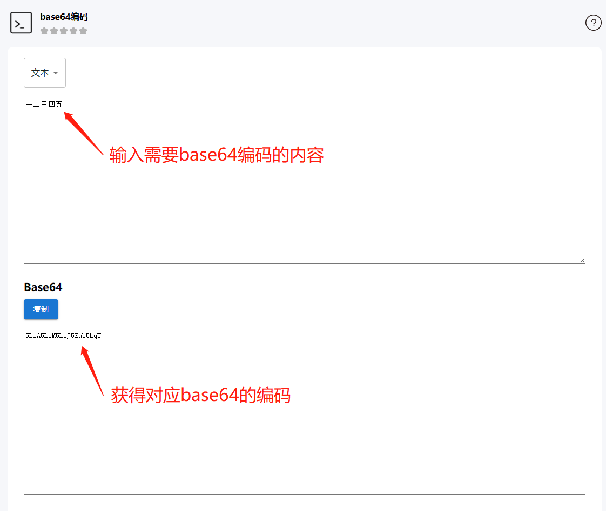

# Microbit Extension: Emakefun Text To Speech

## Example

```blocks
let tts = emakefun.createTextToSpeech(64)

basic.forever(function () {
  tts.speakFromUtf8("hello world")
  basic.pause(2000)
  tts.speakFromBase64("5LiA5LqM5LiJ5Zub5LqU")
  basic.pause(2000)
})
```

## Example Block

[https://makecode.microbit.org/_YrdhvjFbec3V](https://makecode.microbit.org/_YrdhvjFbec3V)

## 如何合成播报中文

由于microbit官方暂未对中文utf8编码完全支持，所以当需要合成中文时，需要把中文内容转成`base64`编码后再给到语音合成模块进行输出，而如果全部是英文的直接使用utf-8文本合成输出即可。

例如，中文`一二三四五`的base64编码为`5LiA5LqM5LiJ5Zub5LqU`，我们把`5LiA5LqM5LiJ5Zub5LqU`输出给base64的文本合成块来进行合成，如下图所示：


### 如何查询base64编码

可以使用这个网站[https://c.runoob.com/front-end/693/](https://c.runoob.com/front-end/693/)，在左边输入内容，再点击`编码`，右边会输出对应的base64编码，如下图所示:


