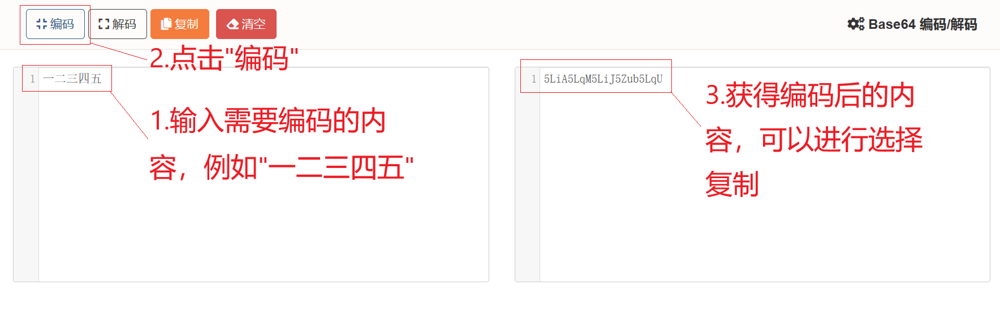
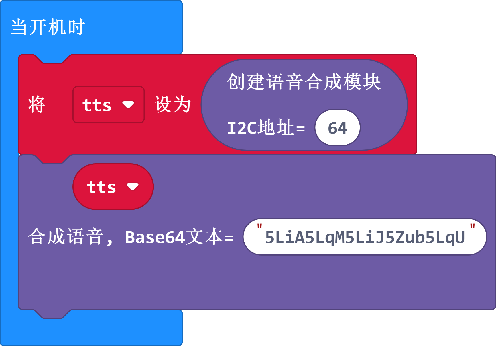

# 如何合成播报中文

由于microbit官方暂未对中文utf8编码完全支持，所以当需要合成中文时，需要把中文内容转成`base64`编码后再给到语音合成模块进行输出，而如果全部是英文的直接使用utf-8文本合成输出即可。

例如，中文`一二三四五`的base64编码为`5LiA5LqM5LiJ5Zub5LqU`，我们把`5LiA5LqM5LiJ5Zub5LqU`输出给base64的文本合成块来进行合成

## 1.查询base64编码

可以使用这个网站[https://c.runoob.com/front-end/693/](https://c.runoob.com/front-end/693/)，在左边输入内容，再点击`编码`，右边会输出对应的base64编码，如下图所示:



## 2.把编码送给base64积木块

- typescript示例

```typescript
let tts = emakefun.createTextToSpeech(64)
tts.speakFromBase64('5LiA5LqM5LiJ5Zub5LqU') //使用speakFromBase64来合成播报base64对应的内容
```

- python示例

```python
tts = emakefun.create_text_to_speech(64)
tts.speak_from_base64("5LiA5LqM5LiJ5Zub5LqU") #使用speak_from_base64合成播报base64对应的内容
```

- 图形化block示例


